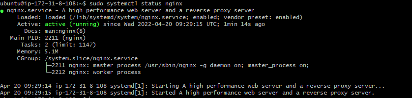
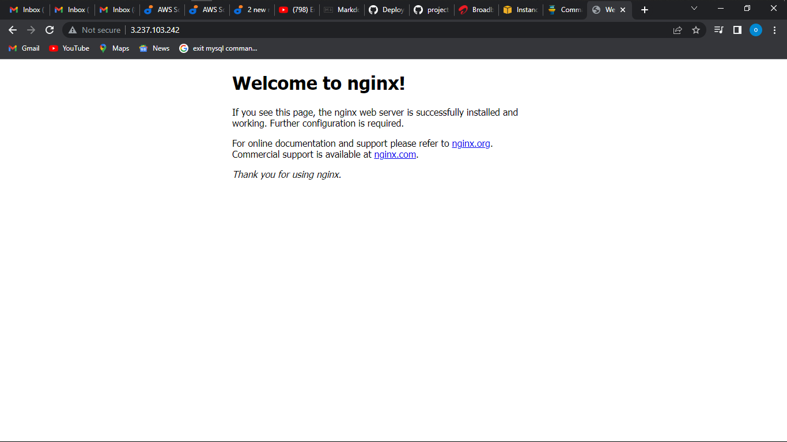
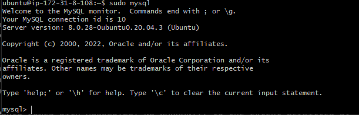
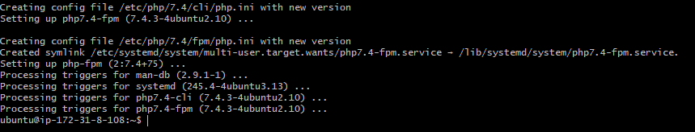
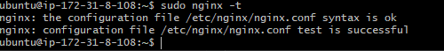
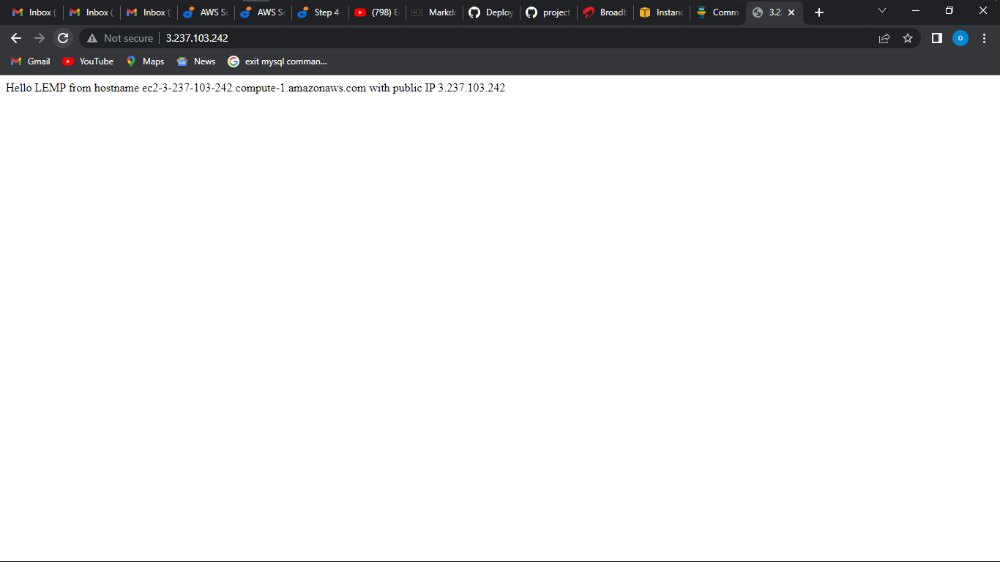
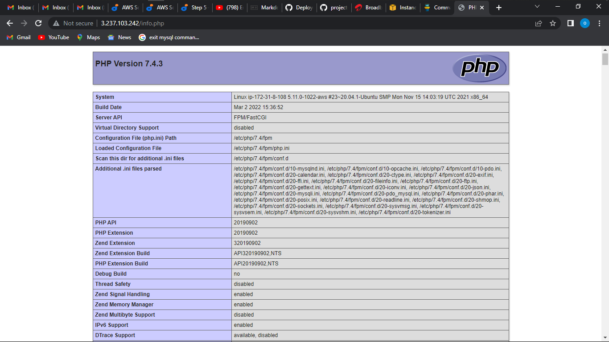
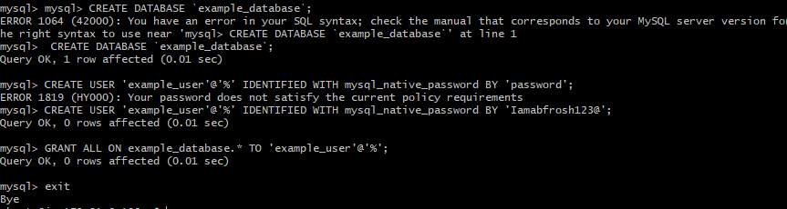
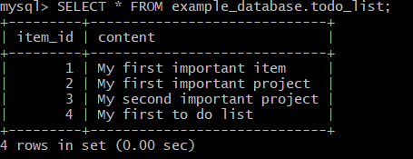
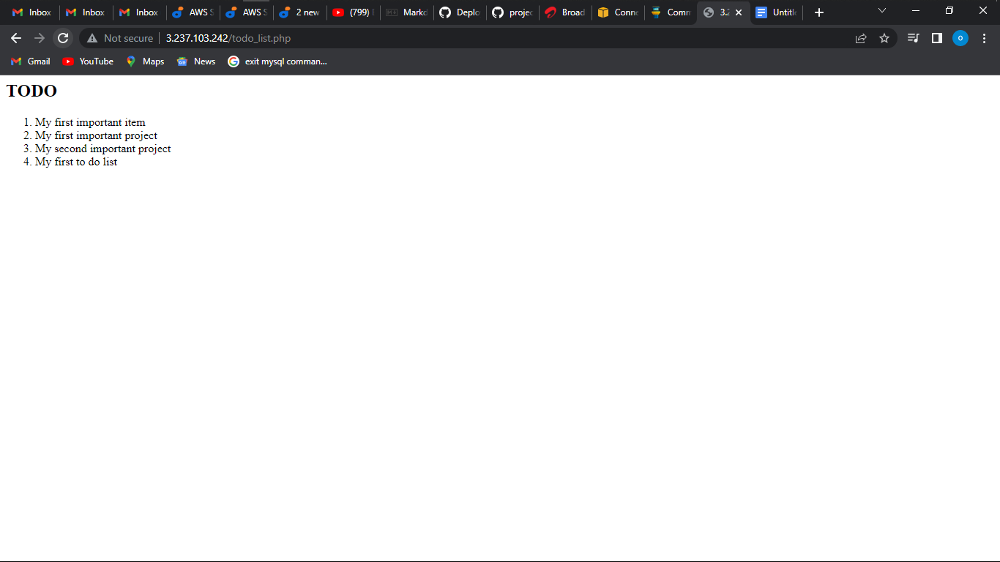

## DOCUMENTATION OF PROJECT 2
Project2 is about the LEMP stack implementation similar to Project1 but we are going to make use of nginx.

Firstly run the command `sudo apt update` after that is succesful we run the command `sudo apt install nginx`

To verify nginx is installed and properly running run the command `sudo systemctl status nginx`

SUCCESS!!!

Now we have created our server in the clouds let us try to check how we can access it locally in our Ubuntu shell we use the command `curl http://127.0.0.1:80` 

Now it is time for us to test how our Nginx server can respond to requests from the Internet we open our browser and try to access our public address

SUCCESS!!!

Next step is installing mysql using the command `sudo apt install mysql-server`
, once that is done and completed we have to secure our installation using the code `sudo mysql_secure_installation`.
Create a secure password

 Log in to mysql using the command `sudo mysql`

 
Succesfuly installed mysql console 

Next step is installing php use the command `sudo apt install php-fpm php-mysql` 

Succesful!!!

Moving on to the next step which is configuring nginx to use php processor.

Firstly we create a root directory for the project using the command `sudo mkdir /var/www/projectLEMP`.
Then assign ownership of the directory with the $USER environment variable, which will reference to the current system user, use command `sudo chown -R $USER:$USER /var/www/projectLEMP`

Next, open a new configuration file in Nginx’s sites-available directory using nano command-line editor with the code `sudo nano /etc/nginx/sites-available/projectLEMP` 

this will open a new blank file then we put in the configurations `#/etc/nginx/sites-available/projectLEMP
server {
    listen 80;
    server_name projectLEMP www.projectLEMP;
    root /var/www/projectLEMP;

    index index.html index.htm index.php;

    location / {
        try_files $uri $uri/ =404;
    }

    location ~ \.php$ {
        include snippets/fastcgi-php.conf;
        fastcgi_pass unix:/var/run/php/php7.4-fpm.sock;
     }

    location ~ /\.ht {
        deny all;
    }

Save and exit the file

Activate the configuration by linking to the config file from Nginx using the code `sudo ln -s /etc/nginx/sites-available/projectLEMP /etc/nginx/sites-enabled/`

now we test for syntax errors using the code `sudo nginx -t`

Succesful

Now we need to disable default Nginx host that is currently configured using the command `sudo unlink /etc/nginx/sites-enabled/default`
 
 New website is now active, but the web root is still empty, now we create an empty index.html file using the command `sudo echo 'Hello LEMP from hostname' $(curl -s http://169.254.169.254/latest/meta-data/public-hostname) 'with public IP' $(curl -s http://169.254.169.254/latest/meta-data/public-ipv4) > /var/www/projectLEMP/index.html`
 Now go to your browser and try to open website URL using IP address:

Succesful loading

 Next step we create a PHP script to test that Nginx is in fact able to handle php files

 This is done by creating a test php file in document root we use the command `sudo nano /var/www/projectLEMP/info.php` then we input the command `<?php
phpinfo();` this is valid php line 

Now we access this page in our browser and loading our public ip address followed by /info.php:

it’s best to remove the file you created as it contains sensitive information use command `sudo rm /var/www/your_domain/info.php`

 Next step we will create a test database (DB) with simple "To do list" and configure access to it.

 First we connect to the root mysql account using `sudo mysql`, now we create a database using the command  CREATE DATABASE `example_database`;

 Now we create a new user and grant full priviledges using the commands respectively `mysql>  CREATE USER 'example_user'@'%' IDENTIFIED WITH mysql_native_password BY 'password';` and `mysql> GRANT ALL ON example_database.* TO 'example_user'@'%';`

now we exit mysql 

Next step is, we’ll create a test table named todo_list. and we run the below script

`CREATE TABLE example_database.todo_list (      item_id INT AUTO_INCREMENT, content VARCHAR(255),
PRIMARY KEY(item_id));`

Insert a few rows of content in the test table use the command `mysql> INSERT INTO example_database.todo_list (content) VALUES ("My first important item");` edit the values to fit 

Now you can create a PHP script that will connect to MySQL and query for your content. we use nano editor for that `nano /var/www/projectLEMP/todo_list.php`

Copy content into the todo_list.php script: then save changes access this page in your web browser by loading local ip address followed by todo_list.php 

 That means your PHP environment is ready to connect and interact with your MySQL server

# SUCCESSFULY IMPLEMENTED LEMPS STACK